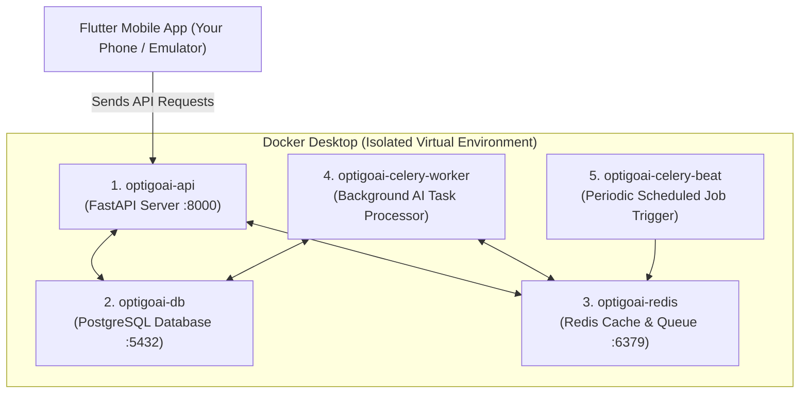
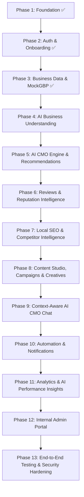

# OptigoAI MVP — Architecture, Docker Guide & Product Roadmap

---

## 1. What Has Been Built (Full Production-Ready Stack)

We have built a **real, production-grade AI Marketing Management platform** with clean architecture, robust APIs, relational persistence, token-guarded background workers, a real-time web admin portal, and a polished mobile app.

```
optigoai/
├── mobile/                  # Flutter mobile application (Android & iOS)
│   ├── lib/
│   │   ├── app/             # Design system (Theme, Light-only, Typography)
│   │   ├── core/            # API endpoints & constants
│   │   ├── data/            # ApiClient, Repositories, Models (User, Business, Review, Content, SEO, etc.)
│   │   └── presentation/    # 5 Core Tabs (Home, Actions, Create, SEO, Reviews), AI CMO Drawer, Auth
│   └── test/                # Automated Flutter widget test suite
│
├── backend/                 # FastAPI backend (Python 3.11)
│   ├── app/
│   │   ├── api/v1/          # REST API endpoints (Auth, Businesses, Reviews, SEO, CMO, Content, Campaigns, Admin)
│   │   ├── core/            # Database (SQLAlchemy 2.0 Async), Redis, JWT Security, Logging
│   │   ├── models/          # 17 PostgreSQL Relational Models
│   │   ├── schemas/         # Pydantic validation schemas
│   │   ├── repositories/    # Clean Data Access Repositories
│   │   ├── services/        # Business logic, AI orchestrators, GBP Sync, GSC, SEO Audits, Admin
│   │   ├── providers/       # Gemini AI, DataForSEO, Firecrawl, MockGBP, SerpAPI, Serper
│   │   └── workers/         # Celery task queue & beat periodic scheduler
│   ├── alembic/             # Database migrations
│   └── tests/               # 26 Pytest test suites (100% Pass)
│
├── web-admin/               # Web Admin Portal (Real-time 3.5s silent auto-sync, AI usage per user/business)
├── docker-compose.yml       # Orchestrates Database, Redis, FastAPI, Celery Worker, Celery Beat
├── CELERY_BACKGROUND_TASKS.md Documentation for Celery background architecture
├── EXTERNAL_API_SETUP_GUIDE.md Setup guide for external providers
├── .env.example             # Safe environment variable template
└── README.md                # Project documentation
```

### Key Deliverables Completed:

| Area | Features Completed |
|------|--------------------|
| **Core Architecture & Multi-Tenancy** | • 17 PostgreSQL database tables with Alembic migrations.<br>• Strict multi-tenant isolation (`User -> Organization -> Business`).<br>• JWT security, structured correlation logging, and Pydantic validation. |
| **AI CMO Strategy & Action Engine** | • Proactive marketing diagnosis computing a 0–100 Marketing Health Score.<br>• Prioritized actionable strategy cards (`URGENT`, `IMPORTANT`, `OPPORTUNITY`).<br>• Interactive AI CMO Assistant Drawer accessible across the app. |
| **Review Intelligence & Auto-Scroll Carousel** | • Real Gemini structured NLP extracting positive/neutral/negative sentiment ratios and top feedback keywords with percentages.<br>• 4-second initial Star Rating card view followed by one-time auto-scroll to Review Intelligence. |
| **SEO & Visibility Optimizer** | • Local keyword rank tracking with Map Pack audit.<br>• Real Google Search Console (OAuth 2.0) impressions/clicks/CTR/queries ingestion.<br>• Technical SEO Website Crawl & AI Audit engine with Firecrawl and SSRF protection. |
| **Autonomous Content & Campaigns Studio** | • Social media generator across GBP, Instagram, Facebook, and LinkedIn.<br>• Multi-channel promotional campaigns with goal selectors.<br>• Smart visual creative banner generator with live customizable themes. |
| **Web Admin Portal & Real-Time Sync** | • Real-time 3.5s silent background polling with live pulsing badge.<br>• Per-user and per-business AI token and cost monitoring (`panekkatt oil and flour mill`, `casaraza`, `alufab`).<br>• Tenant management, feature flags, and system health monitors. |
| **Token-Guarded Celery Background Processing** | • Asynchronous offloading for onboarding, review intelligence, recommendations, audits, and SERP checks.<br>• Token economy guards and change-detection preventing redundant LLM token costs.<br>• Daily and weekly periodic Celery Beat maintenance jobs. |

### Verification Status:
- ✅ **Backend Tests**: 26/26 Pytest tests passed in Docker (100% Pass).
- ✅ **Mobile Analyzer**: `flutter analyze` completed with **0 issues found**.
- ✅ **Security**: Hardened SSRF URL sanitizer and encrypted OAuth tokens.


---

## 2. Docker Explained: What is it & Why are we using it?

If you have never used Docker before, think of it like this:

### 📦 The "Shipping Container" Analogy
Before shipping containers existed, loading cargo onto ships was chaotic—barrels, sacks, and crates of all different shapes and sizes had to be loaded manually, and things broke constantly depending on which port you arrived at.

Standardized steel shipping containers solved this: **anything placed inside the container travels anywhere in the world and fits onto any ship, truck, or train identically.**

> **Docker is a shipping container for software.**

### 🛑 The Problem Without Docker:
When developing a modern backend with Python, PostgreSQL, Redis, and background workers, you would usually have to:
1. Install PostgreSQL database on your Windows machine, configure ports, passwords, and background services.
2. Install Redis cache server on Windows (which is tricky and not officially supported on Windows).
3. Install Python 3.11, C++ build tools for PostgreSQL drivers, and match exact version numbers.
4. When moving from your computer to a cloud server (AWS / Google Cloud / Linux), something always breaks because of differences in operating systems ("*It worked on my machine!*").

### 🚀 How Docker Solves This in OptigoAI:
With Docker, your entire backend runs inside 5 isolated, lightweight "containers":



### What Each Container Does in OptigoAI:

1. **`optigoai-db` (PostgreSQL 16)**:
   - Stores all your business data, users, organizations, reviews, campaigns, and AI logs permanently on disk.
2. **`optigoai-redis` (Redis 7)**:
   - Super-fast in-memory database used as a message queue to pass background jobs to Celery.
3. **`optigoai-api` (FastAPI)**:
   - The web server that handles requests from Flutter (e.g. logging in, fetching recommendations, generating content).
4. **`optigoai-celery-worker` (Celery)**:
   - The background worker. Heavy AI tasks (like analyzing 50 reviews, generating images, or running weekly audits) run here in the background so your mobile app never freezes or lags.
5. **`optigoai-celery-beat` (Scheduler)**:
   - An automated clock that wakes up at scheduled intervals (e.g., daily at 9 AM) to check for new reviews and trigger automated notifications.

### 💡 The Magic:
Whenever you or your team run:
```bash
docker compose up
```
All 5 servers start up in seconds with the exact right settings, databases, and dependencies, without you having to install PostgreSQL or Redis manually on Windows!

---

## 3. Complete Feature Roadmap (Phases 4 – 13)

Here is what will be built in each remaining phase of the OptigoAI MVP:



---

### 🔹 Phase 4 — AI Business Understanding & Health Scoring
- **Real Gemini AI Integration**: Connects Google Gemini API behind the `AIProvider` abstraction.
- **AI Business Profile Generator**: Takes onboarding answers and generates a structured marketing identity (target audience segments, value propositions, tone of voice, growth levers).
- **Business Health Score Engine**: Evaluates current business condition and calculates a **Health Score (0–100)**, identifying top problems and opportunities.
- **AI Usage Tracking**: Automatically logs tokens, latency, and costs to `AIRequestLog`.

---

### 🔹 Phase 5 — AI CMO Engine & Recommendations
- **Central AI CMO Service**: Analyzes the business holistically: *"What is happening? Why does it matter? What should the owner do today?"*
- **Actionable Recommendation Engine**: Produces prioritized cards (`Urgent`, `Important`, `Opportunity`) that connect directly to one-click AI actions (e.g., *"Respond to 3 negative reviews"*, *"Run a promotion for dental implants"*).
- **AI CMO Home Screen**: Mobile dashboard focused on *"What should I do today?"* rather than overwhelming data charts.

---

### 🔹 Phase 6 — Reviews & Reputation Intelligence
- **AI Sentiment & Theme Extraction**: Identifies common customer praise (staff quality, speed) and common complaints (wait times, pricing).
- **"What Customers Are Telling You" Report**: Executive summary of customer feedback.
- **AI Review Reply Generator**: Generates contextual, professional replies in multiple tones (Appreciative, Professional, Apologetic) with Edit / Regenerate / Approve actions.

---

### 🔹 Phase 7 — Local SEO & Competitor Intelligence
- **Local SEO Engine**: Analyzes local search presence, category optimization, and keyword opportunities.
- **Competitor Intelligence**: Analyzes local competitors to identify their weaknesses and highlight opportunities where your business can win customers.

---

### 🔹 Phase 8 — AI Content Studio, Campaigns & Creative Generation
- **AI Content Studio**: Generates marketing copy for Google Business Posts, Instagram/Facebook, Local Ads, and SEO Articles tailored to the business's audience and tone.
- **AI Campaign Generator**: Turns goals (e.g., *"Get 20 new customers for teeth whitening this month"*) into full multi-week campaigns with messaging, schedule, and CTAs.
- **AI Creative Generation**: Generates marketing banners and graphics linked to campaigns, stored in object storage.

---

### 🔹 Phase 9 — AI CMO Chat
- **Context-Aware Marketing Assistant**: Conversational assistant that knows the business's profile, recent reviews, competitors, and ongoing campaigns.
- **Action Triggers**: Can trigger real workflows directly from the conversation (e.g., *"Draft a post for our weekend offer"*).

---

### 🔹 Phase 10 — Automation & Notifications
- **Background Scheduled Tasks (Celery + Redis)**: Automated review monitoring, weekly marketing health checks, and campaign schedule execution.
- **Notification Center**: Real-time alerts for new reviews, detected marketing problems, and high-impact opportunities.

---

### 🔹 Phase 11 — Analytics & AI Performance Insights
- **Business-Focused Metrics**: Track customer calls, profile views, website clicks, and campaign engagement.
- **AI Explanations**: Answers *"What worked, what didn't work, and what should happen next"* in clear business terms.

---

### 🔹 Phase 12 — Internal Admin Web Portal
- **Separate Lightweight Web Portal**: Accessible only to OptigoAI administrators (not visible in the mobile app).
- **Feature Toggles**: Enable/disable features (Content Studio, Creatives, AI Chat) dynamically without redeploying code.
- **Usage & Cost Monitoring**: Track token consumption, API calls, and error rates per organization.
- **Organization Management**: Suspend/reinstate user and business access.

---

### 🔹 Phase 13 — Integration, Security & Deployment
- **Full End-to-End Test Journey**: Automated verification of the entire flow from signup to AI recommendations and campaign generation.
- **Security Audit**: Organization isolation verification, rate limiting, and input sanitization.
- **Production Deployment Config**: Production Docker setup, database migration scripts, and documentation.
